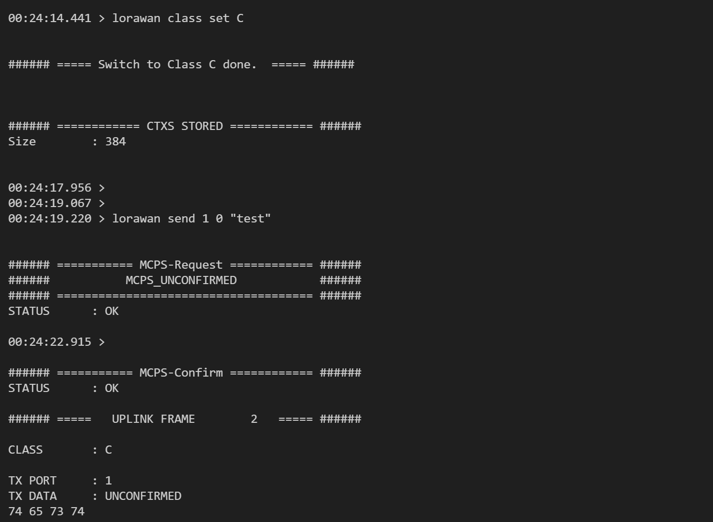

# LoRaWAN Communication

This example demonstrates how to join, send and receive data using the LoRaWAN communicaton stack.

This example leverages the Amazon IoT Core service to exchange data between the development board and the AWS cloud. It allows a LoRaWAN Network Server (LNS) to control the LED on the development board and receive button press notifications.  

**NOTE**: This application can be used with the entire NM1801xx series. Two flash pages are used for LoRaWAN session context located at the end of the last flash blank.

**⚠ WARNING ⚠**: **Change operating region prior to running this example.** 
Default communication occurs in the 900MHz ISM band for use in North America. This frequency may be restricted in other regions. 

## Prerequisites

Complete the following setup steps to prepare cloud resources and device credentials:

1. [AWS IoT Core Integration](doc/aws_iot_core_integration.md)
2. [Adding a LoRaWAN gateway in AWS IoT Core](doc/aws_iot_add_gateway.md)
3. [Adding a LoRaWAN device in AWS IoT Core](doc/aws_iot_add_device.md)

In addition, a LoRaWAN gateway is required to interface the development board with AWS IoT Core.

## Build the Application

For instructions on how to build this reference application and flash the binary to the NM1801XX, follow along step by step in the [Getting Started](doc/getting_started.md) guide.


## Regional Settings
**⚠ WARNING ⚠**: Locate the function call `lorawan_network_config` in 
`application_task.c` and adjust the operating region to ensure compliance
with the local laws.

## Application Description

### LoRaWAN Protocol Stack API
Application firmware interacts with the LoRaWAN protocol stack with the API
defined in `lorawan.h`.  

`lorawan_task` implemented in `lorawan_task.c` handles all the transport layer (OSI layer 4) operations and application layer callback execution.  

Three extension packages are implemented, they are:
* Compliance for certifications.
* Clock Sync for network time synchronization.
* Multicast for multicast communication session.

By default, up to eight commands and eight transmits can be queued up by
`lorawan_task`.  These are defined in `lorawan_task.h` as `LORAWAN_COMMAND_QUEUE_MAX_SIZE`
and `LORAWAN_TRANSMIT_QUEUE_MAX_SIZE` respectively.  Users can adjust the values to
better fit their application requirements.

After a successful join, the stack will issue a MAC layer time sync command.  This
is transparent to the application layer and is performed by the call
`LmHandlerDeviceTimeReq`.  

Network time synchronization is only available on LNSs that support this feature. Time synchronization is available on AWS, The Things Network, and Chirpstack, but may not be available on others.

For usage with a LNS that does not support this feature, comment out `LmHandlerDeviceTimeReq` in
`lorawan_task.c` and `lorawan_request_time_sync` in `application_task.c`.  There is no
operational impact if the commands are left in the code as the MAC command will be silently
dropped on LNSs that do not support this feature.  For applications that roam across
different LNSs, it may be best to leave these calls in place.

During a multicast session, the default behaviour of the stack is to silently drop device transmissions. While the LoRaWAN specification does not prevent an application from transmitting during a multicast session, doing so in practice can impact downlink messages from the LNS.

Applications required to transmit during multicast can comment out the following block inside `lorawan_task_handle_uplink` of `lorawan_task.c`:

```
if (LmhpRemoteMcastSessionStateStarted())
{
    return;
}
```

To transmit a packet, use `lorawan_transmit`.  This API performs a
deep-copy of the payload data so the application layer can pass in data declared on the stack without the risk of data corruption.

For downlink packets, register a callback for the event `LORAWAN_EVENT_RX_DATA` as shown
in `setup_lorawan` in `application_task.c`

```
lorawan_event_callback_register(LORAWAN_EVENT_RX_DATA, on_lorawan_receive);
```

The callback on `lorawan_receive`, executed within `lorawan_task`, is highly latency sensitive. Processing overhead is reduced by copying the payload to a local buffer and sending a message to `application_task` for further processing.  

In this example, we blink the LED twice when a packet is received.  Note that there is no deep-copy performed
on downlink and the payload data is only valid until the next downlink.

### LoRaWAN Session Context
The LoRaWAN stack uses the on-chip flash to store the session context.  By default, two pages
at the end of the flash region are used for storage.  This is defined in the file
`lorawan_config.h` located within the NMSDK2 directory at `targets\nm1801xx\common\comms\lorawan`.

The relevant parameters are `LORAWAN_EEPROM_START_ADDRESS` which indicates the starting page address
and `LORAWAN_EEPROM_NUMBER_OF_PAGES` which indicates the number of pages used.  

If these parameters are changed, the lorawan library must be re-built.  This can be accomplished by setting the
`BUILD_LORAWAN` macro to true in `.vscode/settings.json` located at the application root folder:

```
"cmake.configureArgs": [
    "-Wno-dev",
    "-DCMAKE_VARIANT_BSP=${variant:bsp}",
    "-DFEATURE_RAT_LORAWAN_ENABLE=ON",
    "-DBUILD_LORAWAN=ON",
]
```

**NOTE**: The build process uses CMake. Always do a clean re-configure prior to re-building after any configuration parameter changes.

**⚠ WARNING ⚠**: For applications that make use of both BLE and LoRa radios, adjust the addresses
of the session context if required for both BLE and LoRaWAN to ensure no address collisions occur
between the two protocol stacks.

### Using Button and LED Controls
This example uses two additional UI features that exist in many battery powered IoT applications. A short button press on BTN_0 triggers a transmit. An LED double blink `LED_COMMAND_PULSE2` is used to indicate receive.

Typical usage of these UI features ranges from deployment, to entering into certification mode, or
entering developer mode to manually execute specific commands.
 
## Task Priorities

The application runs in an RTOS and demonstrates the importance of setting task
priorities properly.  

By default, the SDK defines seven priorities ranging from lowest priority zero to highest priority six.  

The OS software timer runs at the highest priority; all software timer callbacks run at priority six and should have the lowest latency.  

Radio communication related tasks are run at priority level five to accommodate real-time constraints required in receive operations.

The remaining assignments are at lower priorities.  In this example, the button
task is set at priority four and the LED task is set at priority three to ensure that
user interaction has minimal delays.

## Using the Command Line Interface

This application includes a command line interface (CLI) over VCOM or RTT for the user to
directly control LoRaWAN operations. 

Connect the EVB or Petal Development Board to the host computer via serial terminal to access the CLI.
For a list of supported commands and usage, type `lorawan help` at the command
prompt.


For example, to join the network from the command line, enter `lorawan join`. The join
procedure could take anywhere from 10 seconds to 2 minutes.  A successful
join will show the following: 


To transmit, short press BTN_0 or type `lorawan send 1 0 <payload>` in the
CLI.  The following will be shown after a successful transmit:


The LNS may at times send MAC commands to the device.  This usually 
occurs during the first few transmits or after a class switch.  MAC messages are communicated over port zero, as shown below:


Issue a class change command to switch to Class A or Class C. For example, issue `lorawan class set C` followed by a transmit to switch to Class C, as shown below:



## Using AWS IoT Core

To view device transmit data from the AWS Console, navigate to the `MQTT test client`
in AWS.  Subscribe to the MQTT topic that used during the device 
destination setup and perform a transmit.


There is no data retention in the test client so it must be active before a transmit
occurs.

To send a packet to the device, navigate to the device dashboard (under LPWAN devices -> Devices) 
and select Device traffic.  Click on `Queue downlink message` and enter the port and payload.

If the device is operating in Class A, the packet will be sent to the device when the next uplink occurs.  

If the device is operating in Class C, the packet will be sent immediately after network processing.


## Communication Rate Limitations

LoRaWAN is not intended to be a real-time protocol.  Excessive transmissions may lead to
undefined behaviour and could violate duty-cycle limits in some regions, such as the EU.  

For example, in Class A operation there are two receive slots with a delay offset from transmit of one second
and two seconds respectively.  Transmitting more often than every three seconds would prevent the device
from properly receiving downlink packets and cause undefined behaviour in the protocol stack.
Additional delay parameters may also exist in the LNS that further constrain how often a transmit
can occur.

How often to transmit depends on the specific application.  A battery powered device may opt
to transmit only a few times per day, but a device attached to infrastructure power may transmit
more frequently.

## Power Management

To reduce power consumption, Petal users have full control over the power supply to the LoRaWAN radio (see documentation in [Petal Core schematics](https://northernmechatronics.com/wp-content/uploads/2024/07/SCH-2002965-005.pdf)
).  

Two callbacks are implemented in this example that control the power to LoRaWAN:

```
on_lorawan_sleep
on_lorawan_wake
```

Further power savings are implemented in `lorawan_task.c`.  When the LoRa radio is shutdown,
a timeout is set for eight seconds to shutdown the SPI port of the Apollo3 processor in the NM1801xx module.  This is implemented
in `radio_port_shutdown` and is invoked by the `radio_port_timer` on timeout inside
`lorawan_task_on_sleep`:

```
xTimerChangePeriod(radio_port_timer, pdMS_TO_TICKS(LORAWAN_SPI_PORT_TIMEOUT), 0);
```

The eight second timeout is set to exceed the longest delay after transmit. The longest delay occurs during the join
process (five seconds for join accept delay 1, and six seconds for join accept delay 2).  

Users working with custom LNS parameters should adjust the SPI port timeout `LORAWAN_SPI_PORT_TIMEOUT` to ensure
proper operations.

## Key Storage Consideration for Production Deployment

The LoRaWAN network keys in this example are hard coded in `application_task.c`.
For production deployment, consider using a provisioning mechanism to deploy
the keys (for example, loading keys into INFO0).  

[Contact NMI](https://northernmechatronics.com/contact-us/) for assistance to securely manage provisioning during production or deployment.
